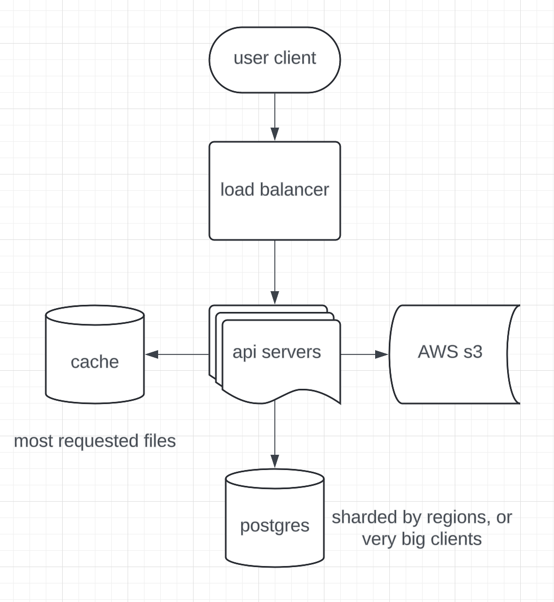

# Diagram Description

## Components

1. **Users (Web/PC/Mobile clients)**
   - Clients using the application.

2. **Load Balancer**
   - Distributes user requests to multiple server API instances.

3. **App Server (business logic)**
   - Handles user requests with multiple instances.
   - Connects to PostgreSQL Database, AWS S3, and Redis Cache.
   - Manages file upload, pause, resume, and cancel operations.

4. **PostgreSQL database**
   - Shards data by user ID(if the client rly big) or region to balance the load.
   - Uses partitioned tables for better performance.
   - Tables:
      - `Users table`: Stores user info.
      - `Folders table`: Stores folder info with a hierarchical structure.
      - `Files table`: Stores file metadata.

5. **AWS S3 (file storage)**
   - Stores files.
   - Uses pre-signed URLs for secure uploads and downloads.

6. **Redis Cache (folder sizes and cache)**
   - Caches folder sizes for quick access.
   - Caches frequently requested files.
   - Syncs with PostgreSQL to ensure data consistency.

7. **Cron Scheduler (periodic update)**
   - Periodically recalculates folder sizes in PostgreSQL.
   - Keeps the Redis cache synchronized with the database.

8. **Region Scaling**
   - Spreads database shards and app servers across regions for low latency and high availability.

## Data Flow

- **Users** interact with the **App Server** via a **Load Balancer**.
- The **Load Balancer** distributes requests to multiple **App Server** instances.
- The **App Server** processes requests, interacts with the sharded **PostgreSQL Database** for metadata, and communicates with **AWS S3** for file storage.
- Folder sizes are cached in **Redis** for quick access, with periodic synchronization by the **Cron Scheduler** to maintain consistency.
- **Database sharding** and **partitioning** manage large datasets and high query volumes efficiently.
- **Regional scaling** spreads system components across multiple regions for better performance and fault tolerance.

## Diagram

